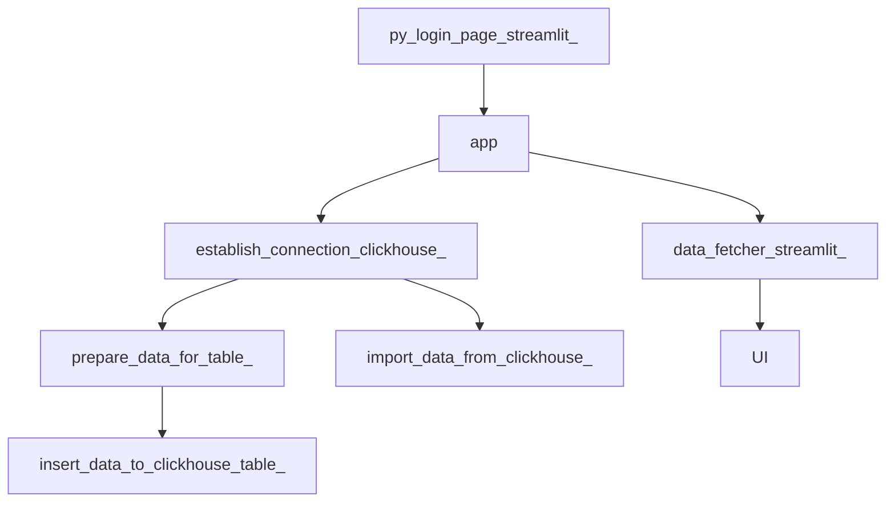

# Incubyte Assignment : Salary Management Tool 

## This is a submission to the assignmnent by incubate

### Problem Statement 
#### Expectations 
This exercise is intentionally designed to assess how you think, design, and build software in an AI‑driven environment.  
   
You are required to use AI tools to accelerate your work. We care about how you use them, the clarity of your thinking, and the quality of your engineering decisions.  
   
We expect you to:  
 - Demonstrate clarity in thought and structured problem solving  
 - Show strong engineering fundamentals & product thinking 
 - Make thoughtful architectural and design decisions  
 - Write production‑quality code and tests  
 - Use AI intentionally while maintaining correctness and quality  
   
Please make incremental commits so we can understand how your solution evolved. 
Goal: 
Build a minimal yet usable salary management tool for an organiszation with 10,000 employees. 
#### User Persona: 
HR Manager of the org 
#### Requirements: 
-  Managing Employees - 
    - Add, View, update, and delete employees via UI 

The employee must have a full name, job title, country, salary, along with any other meaningful data that you believe should be captured 
Salary Insights via UI - 
Minimum, maximum, average salary of employees in a country 
Average salary for the given Job Title in a country. 
Any other meaningful metrics you believe are helpful for the user persona. 

### Proposed Solution 

- Built a MVP with Streamlit (UI), Python (Backbone), and Clickhouse (Database)

#### Frontend (UI)
- Built with Streamlit, has a login page (with persona as HR Manager and Guests)
- Once logged in with proper credentials , leads to the Employee Management Page
- The UI displays options to add and delete desired employees 
- The UI also displays salary insights, and related metrics in visual representations

#### Backend 
- Built with Python 
    + Manages connection with database, and other database operations such as add, delete etc.
    + All dapaters are maintained in `db_utils_`

#### Clickhouse (DB)
- Built a database using dummy employee information, contained in `employee_data_raw_txt_`
- Connection management through user details mentioned in 'pyproject.toml'

.env file contains login passwords which is masked in GIT uploads using file `gitignore`

### Overall Flow
The application follows the illustrated routes

